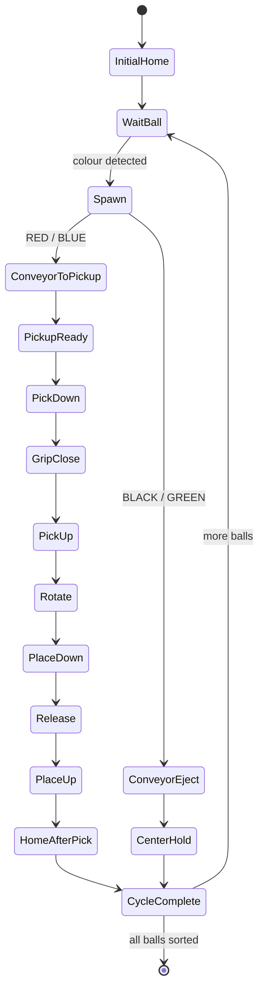

# ev3_manipulator

ROS 2 (Jazzy) packages for the **EV3-brick Lego manipulator** — a robot arm that
picks/sorts objects off a conveyor. Used as a git submodule in
[`project-drishti`](https://github.com/PavanSandaka/project-drishti) at
`bots/ev3_manipulator`.

## Packages
- **`ev3_manipulator`** — the arm: URDF/xacro, meshes, gz (Gazebo Harmonic) sim
  launch, `ros2_control`, and the sorting / hardware-interface nodes.
- **`ev3_manipulator_moveit`** — MoveIt 2 motion-planning config.

## How the sorting pipeline works

The physical EV3 brick and the Gazebo simulation each run their own
independent control loop, kept in lockstep by a **stage-synchronised
TCP protocol** so the sim visually mirrors the real arm move-for-move.

```
 EV3 brick (pybricks-micropython)          ROS 2 host (sorting_node.py)
 ─────────────────────────────────         ──────────────────────────────
 color sensor reads a ball/brick
        │
        ▼
 decide route:
   RED/BLUE  -> pick-and-place into bin
   GREEN/BLACK -> pass straight through
        │
        ▼
 for each stage in the cycle
 (e.g. PICK_DOWN, GRIP_CLOSE, ROTATE_RED):
   1. send  STAGE_START|cycle|seq|stage   ───────▶  drive matching Gazebo
   2. run the motor/sensor action locally           trajectory for that stage
   3. send  STAGE_HW_DONE|cycle|seq|stage ───────▶  (barrier: waits for both
                                                       hardware AND sim to finish)
   4. block until                        ◀───────  STAGE_SYNC_DONE|cycle|seq|stage
      STAGE_SYNC_DONE arrives                       (or STAGE_SYNC_FAILED on error)
        │
        ▼
 next stage / next cycle
```

Each stage above belongs to a per-cycle state machine — one pass through
this for every ball/brick fed onto the conveyor:



- **Where it lives:** the EV3 side is `ev3_manipulator/ev3_manipulator/sorting.py`
  (runs on the brick under pybricks); the ROS 2 side is
  `ev3_manipulator/ev3_manipulator/sorting_node.py` (runs on the dev host,
  drives the `FollowJointTrajectory` action + gripper/conveyor topics).
- **Why a barrier per stage, not a free-running loop:** each stage only
  advances once *both* the physical motor action and the simulated
  trajectory report done, so a stall on either side halts the whole
  cycle instead of the two drifting out of sync.
- **Sort logic:** a full cycle is `MAX_BALLS` colored balls/bricks fed in
  any order. RED and BLUE are picked, rotated to their bin, and dropped;
  the arm re-homes after every RED/BLUE placement. GREEN and BLACK never
  get picked — they're routed past on the conveyor and the arm just holds
  centred.
- **Connection config** (top of `sorting.py`): `ROS2_SERVER_IP` /
  `PORT` — address of the ROS 2 host running `sorting_node.py`, must be
  reachable from the EV3 over the same network. `USE_ROS2_SYNC = False`
  disables the handshake entirely and runs the EV3 standalone (no sim
  mirroring, no barrier waits). `MAX_BALLS` — how many sort cycles run
  before the script exits.

## Build
```bash
colcon build && source install/setup.bash
```

## Running the sorting demo
1. On the ROS 2 host: bring up the Gazebo sim (see Docker section below),
   then run the `sorting_node` — it opens the TCP server and waits for the
   EV3 to connect.
2. On the EV3 brick: run `sorting.py` under pybricks. It connects to
   `ROS2_SERVER_IP:PORT`, performs an initial homing, then waits for a
   ball/brick on the color sensor and works through `MAX_BALLS` cycles.
3. Watch the `[STAGE] ... START / HARDWARE_DONE / SYNC_DONE` log lines on
   the EV3 console and the `sorting_node` ROS logs to confirm each stage is
   completing on both sides before the next one starts.

Work in progress -> to do 
->Current Tasks
**Hardware Synchronization**: Establish real-time communication and state synchronization between the virtual Gazebo model and the physical LEGO EV3 manipulator.
**CI/CD & Deployment**: Containerize the ROS 2 environment into a unified `Dockerfile` for seamless deployment across laboratory workstations.
**Explore MoveIt 2 Integration in the future**: 

> Note: the MoveIt config currently targets the older `manipulator_ev3_brick`
> URDF; re-pointing it to this arm's URDF is a follow-up.

Demo: physical EV3 arm and the Gazebo simulation sorting balls by color in
sync, driven by the stage protocol described above.

https://github.com/user-attachments/assets/9ebfe38d-4cc8-4826-ae7d-aa0d116ae9a8

## Development environment (Docker)

Self-contained envs for a **native Ubuntu host with an NVIDIA GPU**.

### Gazebo / ROS 2 (Jazzy + Gazebo Harmonic)
```bash
xhost +local:docker                                   # once: allow GUI
docker compose -f docker/docker-compose.yml up -d --build
docker compose -f docker/docker-compose.yml exec ev3-manipulator-dev bash
# inside:  cb   (colcon build)   then   cs   (source)
```
Brings up ROS 2 Jazzy + Gazebo Harmonic with `ros_gz`, `gz_ros2_control`,
`ros2_control(lers)`, and MoveIt 2. The repo is mounted at
`/workspace/src/ev3_manipulator`.

### Isaac Sim 5.1 (headless + WebRTC)
See [`docker/isaac-sim/README.md`](docker/isaac-sim/README.md). On Blackwell
(RTX 50-series) the host needs driver **580** — see
[`docker/isaac-sim/DRIVER_DOWNGRADE.md`](https://github.com/PavanSandaka/project-drishti/blob/main/docker/isaac-sim/DRIVER_DOWNGRADE.md).
