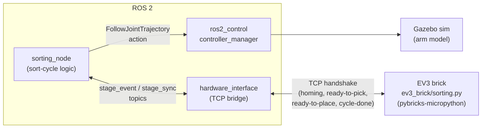

# ev3_manipulator

Stage-synchronized digital twin of a 2.5-DOF EV3 LEGO pick-and-place robot:
the same sort-cycle logic runs in an Ignition Gazebo simulation and on a
physical LEGO Mindstorms EV3 brick, kept in lockstep by TCP interlocks at
every stage. Built with ROS 2 Humble — covering URDF/xacro modeling,
`ros2_control`, Gazebo simulation, and a custom handshake protocol talking to
embedded `pybricks-micropython` on the EV3 hardware. Used as a git submodule in
[`project-drishti`](https://github.com/PavanSandaka/project-drishti) at
`bots/ev3_manipulator`.

Built as a master's project for my mechatronics professor, to get hands-on
with ROS 2 and sim-to-real robotics — modeling a real arm, controlling it in
simulation, and closing the loop with actual hardware over a custom protocol.

https://github.com/user-attachments/assets/a11ed067-34a3-43b9-aa6a-01087d70825e

## Architecture

`sorting_node` drives the sim arm directly via `ros2_control` and stays in
sync with the physical arm through `hardware_interface`, which owns the TCP
link to the EV3 brick. See [`ev3_brick/README.md`](ev3_brick/README.md) for
the wire-level protocol.

## Tech stack
- **ROS 2** (Humble by default, Jazzy supported) — `ros2_control`, URDF/xacro
- **Gazebo** (Fortress/Ignition, or Harmonic on Jazzy) for simulation; **Isaac Sim 5.1** as an alternate sim backend
- **Python** — the ROS-side `sorting_node` and `hardware_interface` nodes
- **pybricks-micropython** — runs on the physical EV3 brick, talks to `hardware_interface` over a TCP handshake
- **MoveIt 2** — scaffolded, not yet integrated (see Status below)
- **Docker** — containerized, GPU-accelerated dev environments for every stack above

## Layout
- **`ev3_manipulator/`** — ROS 2 package: URDF/xacro, meshes, Gazebo sim launch,
  `ros2_control`, and the `sorting_node` / `hardware_interface` nodes that drive
  the sim and talk to the physical brick over TCP.
- **`ev3_brick/`** — **not a ROS 2 package.** `pybricks-micropython` that runs on
  the physical EV3 brick itself; the hardware-side counterpart to
  `hardware_interface.py`. See [`ev3_brick/README.md`](ev3_brick/README.md) for
  the protocol and how to flash it.
- **`ev3_manipulator_moveit/`** — MoveIt 2 config. **Experimental / unused** —
  scaffolding for future MoveIt-based control of the sim and hardware; not
  currently wired into `sorting_node`/`hardware_interface`, and its config still
  targets an older URDF. Explored as future work, not part of the current
  sorting pipeline.

## Quickstart
```bash
git clone git@github.com:AJAYKRISHNAVENKATESAN/ev3_manipulator.git
cd ev3_manipulator
```
Then see [Development environment (Docker)](#development-environment-docker)
below to build and launch the sim — requires a native Ubuntu host with an
NVIDIA GPU and Docker (+
[nvidia-container-toolkit](https://github.com/NVIDIA/nvidia-container-toolkit)).

To run against real EV3 hardware instead of (or alongside) the sim, flash
`ev3_brick/sorting.py` to the brick — see
[`ev3_brick/README.md`](ev3_brick/README.md).

## Status / Roadmap
- **Sim ↔ EV3 stage synchronization — active work.** Both the sim and the
  physical brick run their own sort cycle correctly in isolation.
  `sorting_node.py` and the brick's `ev3_brick/sorting.py` handshake at each
  stage of a sort cycle (homing, ready-to-pick, ready-to-place, cycle-done)
  over the TCP link owned by `hardware_interface.py`. Getting their timing to
  line up stage-for-stage over that handshake is the remaining work — this
  sync is still being fine-tuned, not a finished/stable protocol yet.
- **MoveIt 2 — to be explored in the near future.** `ev3_manipulator_moveit/`
  is experimental scaffolding, not yet wired into the sim/hardware sync above.

## Development environment (Docker)

Self-contained envs for a **native Ubuntu host with an NVIDIA GPU**.

### Default: ROS 2 Humble + Gazebo Fortress (Ignition)
```bash
xhost +local:root                                      # once: allow GUI
docker compose -f docker/docker-compose.yml up -d --build
docker compose -f docker/docker-compose.yml exec ev3-manipulator-dev bash
# inside:  cb   (colcon build)   then   cs   (source)
```
This is the stack the manipulator sim and EV3 hardware sync were authored
against — use this one unless you have a specific reason not to. The repo is
mounted at `/workspace/src/ev3_manipulator`.

### Alternate: ROS 2 Jazzy + Gazebo Harmonic
See [`docker/jazzy/README.md`](docker/jazzy/README.md) — a separate env with its
own container/volumes, for tracking the newer Jazzy/Harmonic stack.

### Isaac Sim 5.1 (headless + WebRTC)
See [`docker/isaac-sim/README.md`](docker/isaac-sim/README.md). On Blackwell
(RTX 50-series) the host needs driver **580** — see
[`docker/isaac-sim/DRIVER_DOWNGRADE.md`](https://github.com/PavanSandaka/project-drishti/blob/main/docker/isaac-sim/DRIVER_DOWNGRADE.md).

## Author
**Ajaykrishna Venkatesan** — [github.com/AJAYKRISHNAVENKATESAN](https://github.com/AJAYKRISHNAVENKATESAN) · aj.grizzy@gmail.com
