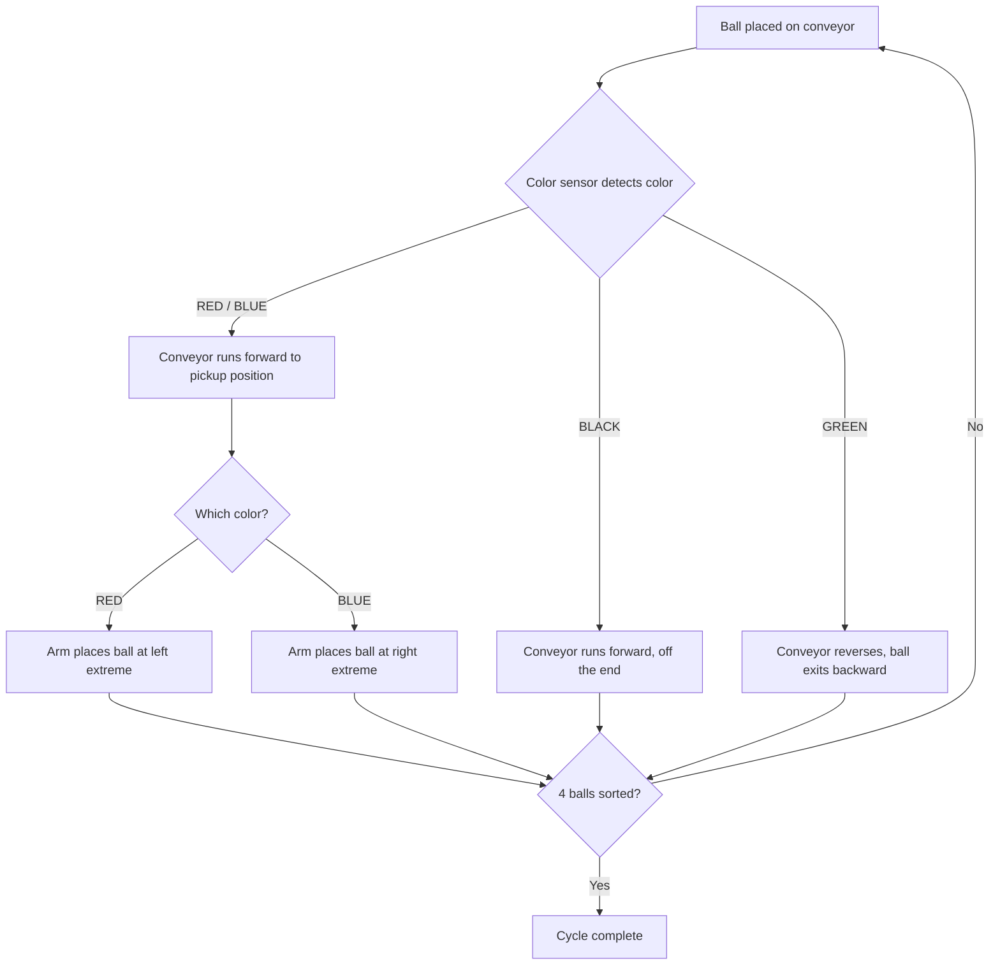

# ev3_manipulator

A ROS 2 pick-and-place pipeline for a 2.5-DOF EV3 LEGO manipulator arm. A
color sensor watches balls fed onto a conveyor and sorts each one by color:
red and blue balls get picked up by the arm and set back down at the side of
the conveyor, black balls run all the way forward off the conveyor, and
green balls get sent back the way they came. Each run sorts exactly four
balls.


*Homing switches for the base and pickup-arm motors — pressing one gives that motor's encoder a known zero point to center its angle from.*

This is done three different ways:
- **`ev3_manipulator_stage_sync`** — runs the sort cycle on both the
  simulator and the real EV3 brick together, staying in step at every stage.
- **`ev3_manipulator_live_sync`** — a live digital twin: continuously
  mirrors the real brick's movement into the simulator.
- **`ev3_manipulator_moveit`** (🚧 work in progress) — plans a
  collision-free path for the arm and drives the `live_sync` digital twin
  along it.

## Pipeline
*(GIF coming soon)*


```mermaid
flowchart TD
    A[Ball placed on conveyor] --> B{Color sensor detects color}
    B -- RED / BLUE --> C[Conveyor runs forward to pickup position]
    C --> D{Which color?}
    D -- RED --> D1[Arm places ball at left extreme]
    D -- BLUE --> D2[Arm places ball at right extreme]
    B -- BLACK --> E[Conveyor runs forward, off the end]
    B -- GREEN --> F[Conveyor reverses, ball exits backward]
    D1 --> G{4 balls sorted?}
    D2 --> G
    E --> G
    F --> G
    G -- No --> A
    G -- Yes --> H[Cycle complete]
```
After all four balls are sorted, the cycle ends.

## Packages
- [`ev3_manipulator_stage_sync`](ev3_manipulator_stage_sync/README.md)
- [`ev3_manipulator_live_sync`](ev3_manipulator_live_sync/README.md)
- [`ev3_manipulator_moveit`](ev3_manipulator_moveit/README.md) (🚧 work in progress)
- [`conveyor_belt/`](conveyor_belt/) — vendored third-party Gazebo-ROS2 conveyor
  belt plugin
  ([IFRA-Cranfield/IFRA_ConveyorBelt](https://github.com/IFRA-Cranfield/IFRA_ConveyorBelt))

## Tech stack
- **ROS 2** (Humble by default, Jazzy supported) — `ros2_control`, URDF/xacro
- **Gazebo** (Fortress/Ignition, or Harmonic on Jazzy) for simulation; **Isaac Sim 5.1** as an alternate sim backend
- **Python** — each package's `sorting_node` and `hardware_interface` nodes
- **pybricks-micropython** — runs on the physical EV3 brick; talks to `hardware_interface` over TCP (a stage handshake for `stage_sync`, a continuous telemetry stream for `live_sync`)
- **MoveIt 2** — scaffolded, not yet integrated
- **Docker** — containerized, GPU-accelerated dev environments for every stack above

## Quickstart
```bash
git clone git@github.com:AJAYKRISHNAVENKATESAN/ev3_manipulator.git
cd ev3_manipulator
xhost +local:root                                      # once: allow GUI
docker compose -f docker/docker-compose.yml up -d --build
docker compose -f docker/docker-compose.yml exec ev3-manipulator-dev bash
# inside:  cb   (colcon build)   then   cs   (source)
```
Requires a native Ubuntu host with an NVIDIA GPU and Docker (+
[nvidia-container-toolkit](https://github.com/NVIDIA/nvidia-container-toolkit)) — the
container itself is a plain ROS 2 image; GPU access comes entirely from the toolkit
passing the host driver through. There's no CPU-only / software-rendering path
configured yet, so a host without a supported NVIDIA GPU + driver can't run this sim
stack at all right now.
For ROS 2 Jazzy/Gazebo Harmonic instead, see
[docs/development.md](docs/development.md).

To run against real EV3 hardware instead of (or alongside) the sim, flash the
relevant package's firmware `sorting.py` to the brick — see each package's
README for what its firmware does.

## Author
**Ajaykrishna Venkatesan** — [github.com/AJAYKRISHNAVENKATESAN](https://github.com/AJAYKRISHNAVENKATESAN) · aj.grizzy@gmail.com
