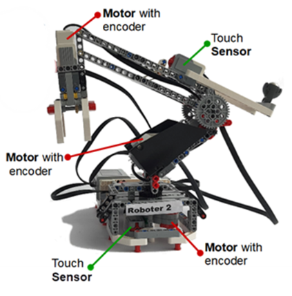
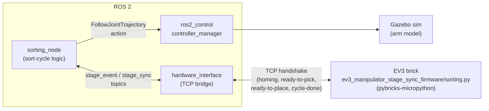
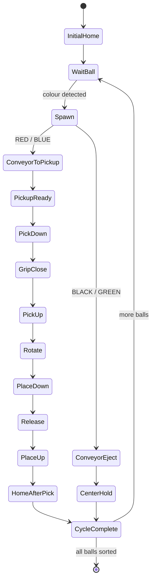
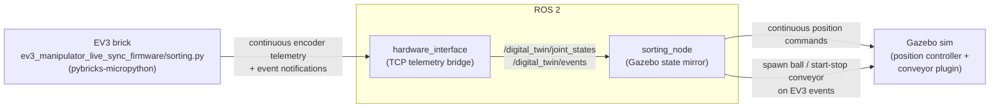
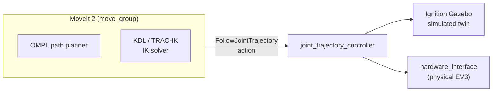

# ev3_manipulator

Two independent ROS 2 packages for a 2.5-DOF EV3 LEGO pick-and-place robot,
each keeping a Gazebo digital twin in sync with the physical hardware a
different way:

- **`ev3_manipulator_stage_sync`** — the same sort-cycle logic runs both in
  an Ignition Gazebo simulation and on a physical LEGO Mindstorms EV3 brick,
  kept in lockstep by TCP interlocks at every stage.
- **`ev3_manipulator_live_sync`** — a pure digital twin: the sim continuously
  mirrors the physical brick's live encoder telemetry over TCP, with no stage
  barrier or handshake.
- **Stack:** ROS 2 Humble, URDF/xacro modeling, `ros2_control`, Ignition
  Gazebo simulation, and a custom protocol talking to embedded
  `pybricks-micropython` on the EV3 hardware.
- **Context:** used as a git submodule in
  [`project-drishti`](https://github.com/PavanSandaka/project-drishti) at
  `bots/ev3_manipulator`.
- **Why:** built as a master's project for my mechatronics professor, to get
  hands-on with ROS 2 and sim-to-real robotics — modeling a real arm,
  controlling it in simulation, and closing the loop with actual hardware
  over two different sync strategies.


*Homing switches for the base and pickup-arm motors — pressing one gives that motor's encoder a known zero point to center its angle from.*

https://github.com/user-attachments/assets/a11ed067-34a3-43b9-aa6a-01087d70825e

## Architecture

### ev3_manipulator_stage_sync

```mermaid
flowchart LR
    subgraph ROS 2
        SN["sorting_node<br/>(sort-cycle logic)"]
        HI["hardware_interface<br/>(TCP bridge)"]
        CM["ros2_control<br/>controller_manager"]
    end
    SIM["Gazebo sim<br/>(arm model)"]
    BRICK["EV3 brick<br/>ev3_manipulator_stage_sync_firmware/sorting.py<br/>(pybricks-micropython)"]

    SN -- "FollowJointTrajectory<br/>action" --> CM --> SIM
    SN <-- "stage_event / stage_sync<br/>topics" --> HI
    HI <-- "TCP handshake<br/>(homing, ready-to-pick,<br/>ready-to-place, cycle-done)" --> BRICK
```
`sorting_node` drives the sim arm directly via `ros2_control` and stays in
sync with the physical arm through `hardware_interface`, which owns the TCP
handshake link to the EV3 brick.

Each stage above belongs to a per-cycle state machine — one pass through
this for every ball/brick fed onto the conveyor:


```mermaid
stateDiagram-v2
    [*] --> InitialHome
    InitialHome --> WaitBall
    WaitBall --> Spawn : colour detected
    Spawn --> ConveyorToPickup : RED / BLUE
    Spawn --> ConveyorEject : BLACK / GREEN

    ConveyorToPickup --> PickupReady
    PickupReady --> PickDown
    PickDown --> GripClose
    GripClose --> PickUp
    PickUp --> Rotate
    Rotate --> PlaceDown
    PlaceDown --> Release
    Release --> PlaceUp
    PlaceUp --> HomeAfterPick
    HomeAfterPick --> CycleComplete

    ConveyorEject --> CenterHold
    CenterHold --> CycleComplete

    CycleComplete --> WaitBall : more balls
    CycleComplete --> [*] : all balls sorted
```

### ev3_manipulator_live_sync

```mermaid
flowchart LR
    subgraph ROS 2
        HI["hardware_interface<br/>(TCP telemetry bridge)"]
        SN["sorting_node<br/>(Gazebo state mirror)"]
    end
    BRICK["EV3 brick<br/>ev3_manipulator_live_sync_firmware/sorting.py<br/>(pybricks-micropython)"]
    SIM["Gazebo sim<br/>(position controller +<br/>conveyor plugin)"]

    BRICK -- "continuous encoder telemetry<br/>+ event notifications" --> HI
    HI -- "/digital_twin/joint_states<br/>/digital_twin/events" --> SN
    SN -- "continuous position commands" --> SIM
    SN -- "spawn ball / start-stop conveyor<br/>on EV3 events" --> SIM
```
Unlike `stage_sync`, there's no handshake or stage barrier: `hardware_interface`
streams the brick's encoder positions/velocities to ROS as fast as they
arrive, and `sorting_node` mirrors them straight into the sim's position
controller every cycle. It only reacts *discretely* to two EV3-reported
events — spawning a ball on ball-detected, and starting/stopping the
simulated conveyor around a pickup action — everything else is continuous
mirroring, not scripted stages.

### ev3_manipulator_moveit (🚧 work in progress)

```mermaid
flowchart LR
    subgraph MoveIt2 ["MoveIt 2 (move_group)"]
        PL["OMPL path planner"]
        IK["KDL / TRAC-IK<br/>IK solver"]
    end
    JTC["joint_trajectory_controller"]
    SIM["Ignition Gazebo<br/>simulated twin"]
    HW["hardware_interface<br/>(physical EV3)"]

    MoveIt2 -- "FollowJointTrajectory<br/>action" --> JTC
    JTC --> SIM
    JTC --> HW
```
The intended design: `move_group` plans a path with OMPL, solves IK, and
sends it as a single `FollowJointTrajectory` action to a
`joint_trajectory_controller` that drives *both* the Gazebo twin and the
physical EV3 through `hardware_interface` — one plan, two targets. Not wired
up yet: `ev3_manipulator_moveit/` is still scaffolding (see Status below).

## Tech stack
- **ROS 2** (Humble by default, Jazzy supported) — `ros2_control`, URDF/xacro
- **Gazebo** (Fortress/Ignition, or Harmonic on Jazzy) for simulation; **Isaac Sim 5.1** as an alternate sim backend
- **Python** — each package's `sorting_node` and `hardware_interface` nodes
- **pybricks-micropython** — runs on the physical EV3 brick; talks to `hardware_interface` over TCP (a stage handshake for `stage_sync`, a continuous telemetry stream for `live_sync`)
- **MoveIt 2** — scaffolded, not yet integrated (see Status below)
- **Docker** — containerized, GPU-accelerated dev environments for every stack above

## Layout
- **`ev3_manipulator_stage_sync/`** — ROS 2 package: URDF/xacro, meshes,
  Gazebo sim launch, `ros2_control`, dev `tools/`, and the `sorting_node` /
  `hardware_interface` nodes that drive the sim and talk to the physical
  brick over a TCP handshake. `ev3_manipulator_stage_sync_firmware/` holds
  the `pybricks-micropython` counterpart that runs on the EV3 brick itself —
  **not a ROS 2 package** (colcon-ignored).
- **`ev3_manipulator_live_sync/`** — same shape as `stage_sync`, but
  `hardware_interface` receives a continuous EV3 telemetry stream instead of
  a stage handshake, and `sorting_node` mirrors it straight into the sim with
  no synchronization barrier. `ev3_manipulator_live_sync_firmware/` is its
  EV3-side counterpart — also not a ROS 2 package.
- **`ev3_manipulator_moveit/`** — MoveIt 2 config. **Experimental / unused** —
  scaffolding for future MoveIt-based control of the sim and hardware; not
  currently wired into either package's `sorting_node`/`hardware_interface`,
  and its config still targets an older URDF. Explored as future work, not
  part of either current sorting pipeline.
- **`conveyor_belt/`** — vendored third-party Gazebo-ROS2 conveyor belt
  plugin ([IFRA-Cranfield/IFRA_ConveyorBelt](https://github.com/IFRA-Cranfield/IFRA_ConveyorBelt)),
  used by both packages' simulations.

## Quickstart
```bash
git clone git@github.com:AJAYKRISHNAVENKATESAN/ev3_manipulator.git
cd ev3_manipulator
```
Then see [Development environment (Docker)](#development-environment-docker)
below to build and launch the sim — requires a native Ubuntu host with an
NVIDIA GPU and Docker (+
[nvidia-container-toolkit](https://github.com/NVIDIA/nvidia-container-toolkit)).

To run against real EV3 hardware instead of (or alongside) the sim, flash the
relevant package's firmware `sorting.py` to the brick — see the Layout
section above for what each package's firmware does.

## Status / Roadmap
- **`ev3_manipulator_stage_sync` — active work.** Both the sim and the
  physical brick run their own sort cycle correctly in isolation.
  `sorting_node.py` and the brick's firmware `sorting.py` handshake at each
  stage of a sort cycle (homing, ready-to-pick, ready-to-place, cycle-done)
  over the TCP link owned by `hardware_interface.py`. Getting their timing to
  line up stage-for-stage over that handshake is the remaining work — this
  sync is still being fine-tuned, not a finished/stable protocol yet.
- **`ev3_manipulator_live_sync` — telemetry mirroring.** Continuously mirrors
  EV3 encoder state into the sim and triggers ball spawn / conveyor
  start-stop from EV3-reported events. Exact spatial alignment at the pickup
  point still depends on calibrating the simulated conveyor's pickup timing
  against the EV3 action duration and belt geometry.
- **MoveIt 2 — to be explored in the near future.** `ev3_manipulator_moveit/`
  is experimental scaffolding, not yet wired into either sim/hardware sync
  above.

## Development environment (Docker)

Self-contained envs for a **native Ubuntu host with an NVIDIA GPU**.

### Default: ROS 2 Humble + Gazebo Fortress (Ignition)
```bash
xhost +local:root                                      # once: allow GUI
docker compose -f docker/docker-compose.yml up -d --build
docker compose -f docker/docker-compose.yml exec ev3-manipulator-dev bash
# inside:  cb   (colcon build)   then   cs   (source)
```
This is the stack the manipulator sim and EV3 hardware sync were authored
against — use this one unless you have a specific reason not to. The repo is
mounted at `/workspace/src/ev3_manipulator`.

### Alternate: ROS 2 Jazzy + Gazebo Harmonic
See [`docker/jazzy/README.md`](docker/jazzy/README.md) — a separate env with its
own container/volumes, for tracking the newer Jazzy/Harmonic stack.

### Isaac Sim 5.1 (headless + WebRTC)
See [`docker/isaac-sim/README.md`](docker/isaac-sim/README.md). On Blackwell
(RTX 50-series) the host needs driver **580** — see
[`docker/isaac-sim/DRIVER_DOWNGRADE.md`](https://github.com/PavanSandaka/project-drishti/blob/main/docker/isaac-sim/DRIVER_DOWNGRADE.md).

## Author
**Ajaykrishna Venkatesan** — [github.com/AJAYKRISHNAVENKATESAN](https://github.com/AJAYKRISHNAVENKATESAN) · aj.grizzy@gmail.com
