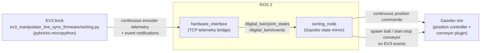

# ev3_manipulator_live_sync

ROS 2 package that mirrors a physical LEGO Mindstorms EV3 brick's live
encoder telemetry into a Gazebo digital twin — a pure mirror, with no stage
handshake or sync barrier.

## Layout
Same shape as `stage_sync`: URDF/xacro, meshes, Gazebo sim launch,
`ros2_control`, dev `tools/`, and the `sorting_node` / `hardware_interface`
nodes. Here, `hardware_interface` receives a continuous EV3 telemetry stream
instead of a stage handshake, and `sorting_node` mirrors it straight into the
sim with no synchronization barrier. `ev3_manipulator_live_sync_firmware/`
is its EV3-side counterpart — **not a ROS 2 package** (colcon-ignored).

## Architecture

Unlike `stage_sync`, there's no handshake or stage barrier: `hardware_interface`
streams the brick's encoder positions/velocities to ROS as fast as they
arrive, and `sorting_node` mirrors them straight into the sim's position
controller every cycle. It only reacts *discretely* to two EV3-reported
events — spawning a ball on ball-detected, and starting/stopping the
simulated conveyor around a pickup action — everything else is continuous
mirroring, not scripted stages.

## Status
**Telemetry mirroring.** Continuously mirrors EV3 encoder state into the sim
and triggers ball spawn / conveyor start-stop from EV3-reported events.
Exact spatial alignment at the pickup point still depends on calibrating the
simulated conveyor's pickup timing against the EV3 action duration and belt
geometry.
