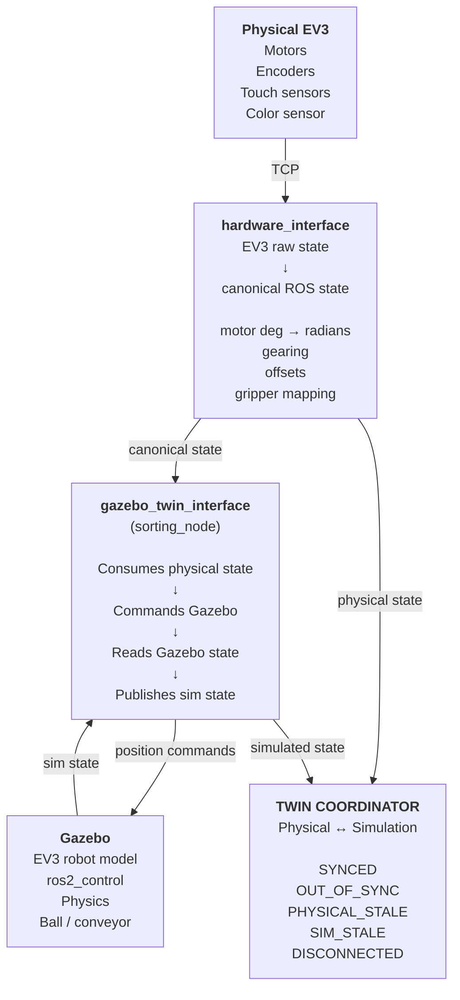

# ev3_manipulator_live_twin_sync

ROS 2 package that coordinates a live **digital twin** between the physical
LEGO Mindstorms EV3 brick and its Gazebo simulation. It builds on
`ev3_manipulator_mirror_sync`'s continuous mirroring, adding a
`twin_coordinator` node that independently checks the physical and
simulated arms actually stay within tolerance of each other, instead of
just assuming the mirror is accurate.

## Layout
Same shape as `mirror_sync`: URDF/xacro, meshes, Gazebo sim launch,
`ros2_control`, dev `tools/`, plus the `hardware_interface`, `sorting_node`
(the `gazebo_twin_interface` in the diagram below) and `twin_coordinator`
nodes. `ev3_manipulator_live_twin_sync_firmware/` is its EV3-side
counterpart — **not a ROS 2 package** (colcon-ignored).

## Architecture

`hardware_interface` turns the EV3's raw motor/encoder readings (degrees,
per-motor gearing, offsets, gripper-specific mapping) into canonical ROS
joint state. That state goes two places: sideways into
`gazebo_twin_interface`, which commands Gazebo and reads its state back,
and directly up to `twin_coordinator` as the physical-side input.
`gazebo_twin_interface` publishes the simulated state as the sim-side
input to `twin_coordinator`.

`twin_coordinator` continuously compares the two. If either side goes
stale, the physical brick disconnects, or a joint drifts past its
tolerance, it reports that explicitly — `SYNCED`, `OUT_OF_SYNC`,
`PHYSICAL_STALE`, `SIM_STALE`, `DISCONNECTED` — on `/twin/state`,
`/twin/synchronized`, and `/twin/status`, instead of silently assuming
the twin stays accurate.

## Status
**Phase 1: observation, not control.** `twin_coordinator` validates
synchronization between the physical and simulated arms but doesn't yet
arbitrate commands or drive MoveIt execution — see the module's own
docstring for what Phase 2 adds.
