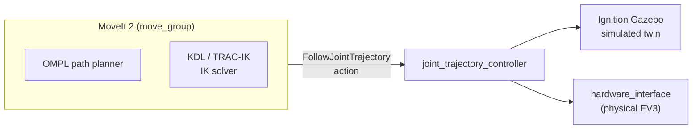

# ev3_manipulator_moveit (🚧 work in progress)

MoveIt 2 config for the EV3 manipulator — scaffolding for future MoveIt-based
control of the sim and hardware. **Experimental / unused**: not currently
wired into either `stage_sync` or `live_sync`'s `sorting_node` /
`hardware_interface`, and its config still targets an older URDF. Explored
as future work, not part of either current sorting pipeline.

## Architecture

The intended design: `move_group` plans a path with OMPL, solves IK, and
sends it as a single `FollowJointTrajectory` action to a
`joint_trajectory_controller` that drives *both* the Gazebo twin and the
physical EV3 through `hardware_interface` — one plan, two targets. Not wired
up yet: this package is still scaffolding (see Status below).

## Status
**To be explored in the near future.** This package is experimental
scaffolding, not yet wired into either sim/hardware sync pipeline above.
