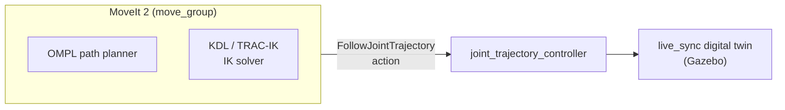
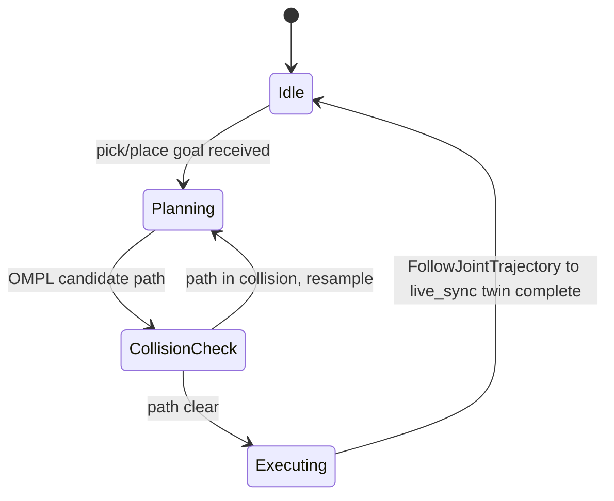

# ev3_manipulator_moveit (🚧 work in progress)

MoveIt 2 config for the EV3 manipulator. **🚧 Active development**: collision-free
path planning for the `live_sync` digital twin. Not yet wired into `live_sync`'s
`sorting_node` / `hardware_interface`, and its config still targets an older URDF.

## Architecture

The intended design: `move_group` plans a path with OMPL, solves IK, and
sends it as a `FollowJointTrajectory` action to a `joint_trajectory_controller`
that drives the `live_sync` digital twin. Not wired up yet: this package is
still scaffolding (see Status below).

Each planning attempt belongs to this loop — resample on collision, execute
once clear:

## Status
**Active work: collision-free path planning for the `live_sync` digital
twin.** OMPL plans a path, checked for collisions, then sent as a single
`FollowJointTrajectory` action to drive `live_sync`'s simulated arm. Not yet
wired into `hardware_interface` for the physical EV3.
