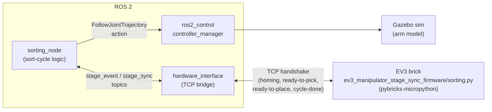
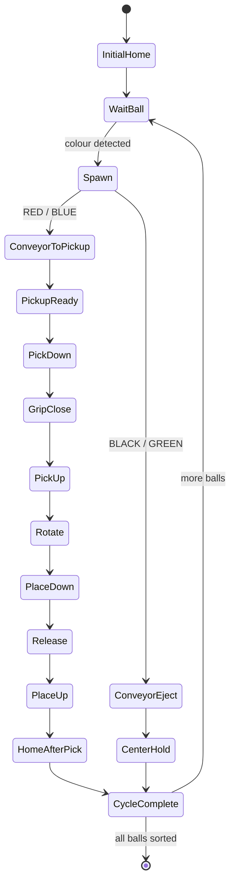

# ev3_manipulator_stage_sync

ROS 2 package that runs the same sort-cycle logic both in an Ignition Gazebo
simulation and on a physical LEGO Mindstorms EV3 brick, kept in lockstep by a
TCP handshake at every stage of the cycle.

## Layout
URDF/xacro, meshes, Gazebo sim launch, `ros2_control`, dev `tools/`, and the
`sorting_node` / `hardware_interface` nodes that drive the sim and talk to
the physical brick. `ev3_manipulator_stage_sync_firmware/` holds the
`pybricks-micropython` counterpart that runs on the EV3 brick itself — **not
a ROS 2 package** (colcon-ignored).

## Architecture

`sorting_node` drives the sim arm directly via `ros2_control` and stays in
sync with the physical arm through `hardware_interface`, which owns the TCP
handshake link to the EV3 brick.

Each stage above belongs to a per-cycle state machine — one pass through
this for every ball/brick fed onto the conveyor:

## Status
**Active work.** Both the sim and the physical brick run their own sort
cycle correctly in isolation. `sorting_node.py` and the brick's firmware
`sorting.py` handshake at each stage of a sort cycle (homing, ready-to-pick,
ready-to-place, cycle-done) over the TCP link owned by
`hardware_interface.py`. Getting their timing to line up stage-for-stage
over that handshake is the remaining work — this sync is still being
fine-tuned, not a finished/stable protocol yet.
